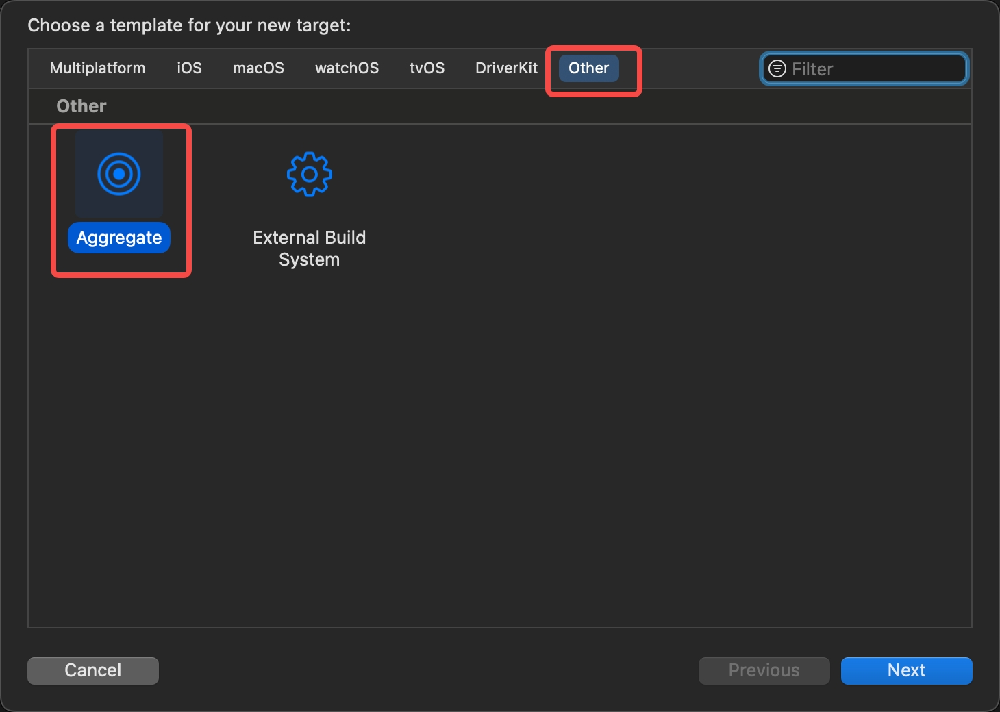
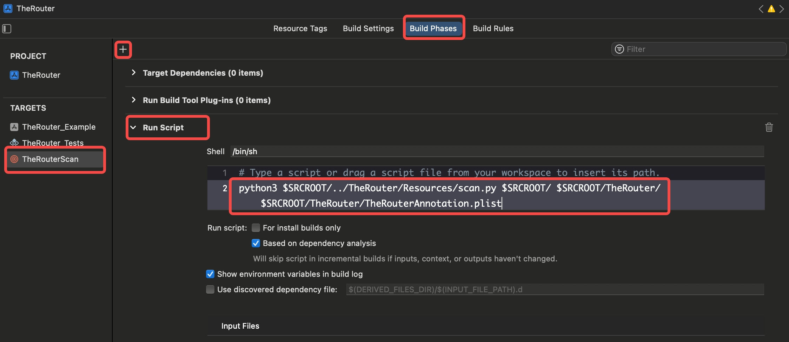
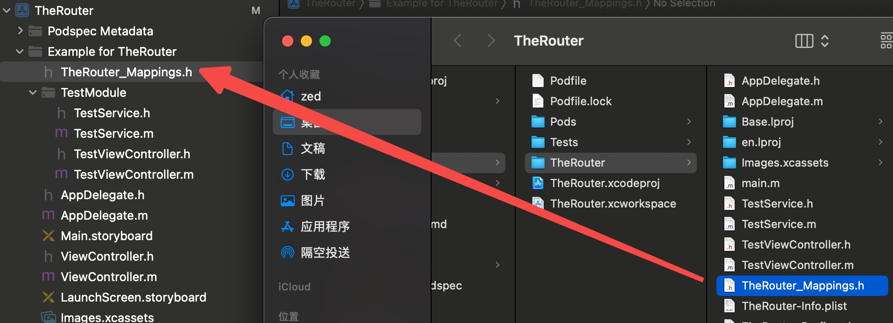

# TheRouter

[](https://www.apache.org/licenses/LICENSE-2.0)
[]()
[]()
[](https://xxx.com)

> [中文文档](README_CN.md)

## Features

TheRouter is a product of the same support [Android](https://github.com/HuolalaTech/hll-wp-therouter-android) and iOS lightweight routing middleware, the iOS side absorbs other language features, support [Annotation](https://juejin.cn/post/6999484997782470669) function, It greatly improves the feel of using routes in iOS. Instead of the traditional ioser target-action or protocol concept, it is aligned to the broader background or Android application.

`TheRouter core functions have four major capabilities:`

* **Page navigation jump ability:** support regular vc or Storyboard push/present jump ability;
* **Automatic registration capability:** similar to Java annotation function, route registration can be completed by marking the vc class or any method;
* **Hard-coding elimination:** Built-in scripts automatically convert registered path to static string constants for business use;
* **Dynamic capabilities:** support for adding weights, interceptors, etc.

## Module Description

```
.
├── Classes
│   ├── TheRouter+Annotation.h
│   ├── TheRouter+Annotation.m  // Route annotator and Path functionality extension
│   ├── TheRouter.h
│   └── TheRouter.m             // Routing library core code (add, delete, check, redirect/interceptor)
└── Resources
    └── scan.py                 // Annotation scanning and hardcoded processing scripts (this script will only be referenced and will not be involved in compilation and packaging)
```

## Introduction

#### Cocoapods imported

```ruby
pod 'TheRouter'
```

#### Annotation use

**step1**

Create `TheRouterAnnotation.plist` file, must be under the MainBundle.

**step2**

Create a target of type Aggregate for the project:



**step3**

Add a script to the newly created target:



Example script parameters:

```shell
python3 $SRCROOT/../TheRouter/Resources/scan.py     # Script path
$SRCROOT/                                           # Parameter 1: Scan path, usually the project root
$SRCROOT/TheRouter/                                 # Parameter 2: Path definition header file storage directory is generally stored in the public module
$SRCROOT/TheRouter/TheRouterAnnotation.plist        # Parameter 3: TheRouterAnnotation file path
```

**step4**

When the application is loaded, register the host, add route annotation on the VC class you want to jump to, or create a Service class for the corresponding module, and add annotation on the method in the Service, for example:

Register the project host:

```
[TheRouter.shared registPathAnnotationsWithHost:@"hd://com.therouter.test"];
```

Add vc annotations:

```
TheRouterController(test/vc, TestViewController)
@interface TestViewController : UIViewController

@end
```

Add the Service annotation:

```
#import "TestService.h"
#import "TheRouter_Mappings.h"
#import <TheRouter/TheRouter+Annotation.h>

@implementation TestService

TheRouterSelector(test/jump, jumpToTestVC, TestService)
+ (id)jumpToTestVC:(TheRouterInfo *)routerInfo
{
    UIViewController *vc = [TheRouter.shared openVCPath:kRouterPathTestVcVC
                                                    cmd:TheRouterOpenCMDPush
                                             withParams:@{@"title":@"123"}
                                                hanlder:^(NSString * _Nonnull tag, NSDictionary * _Nullable result) {
        !routerInfo.openCompleteHandler ?: routerInfo.openCompleteHandler(tag, result);
    }];
    return vc;
}

@end

```

**step5**

Every time the right to increase when the compiler to create a great target, to `TheRouterAnnotation.plist` automatically. The file write information, and in the specified directory to generate `TheRouter_Mappings.h` file, the file into the corresponding module



#### Interceptors and redirects

**Interceptors:**

```
// As long as access to hd://com.therouter.test or its path (hd://com.therouter.test/xxx) will enter the callback
// If YES is returned, the corresponding route event can be executed; otherwise, the route event will be blocked and not executed
[TheRouter.shared registInterceptorForURLString:@"hd://com.therouter.test/*" handler:^BOOL(TheRouterInfo * _Nonnull router, id  _Nullable (^ _Nonnull continueHandle)(void)) {
    NSLog(@"will execute router %@", router.URLString);
    return YES;
}];
```

**Redirection:**

```
// Redirection refers to the hd://test.com/test/vc event when visiting hd://test.com/test, which is used to migrate the old path or quickly change to another page to take on the business when encountering problems on production environment
[TheRouter.shared registRedirect:@"hd://test.com/test" to:@"hd://test.com/test/vc"];
```

#### Executing route events

```
UIViewController *vc = [TheRouter.shared openVCPath:kRouterPathTestVcVC    // Passing Path
                                                cmd:TheRouterOpenCMDPush   // Specifying the open command
                                         withParams:@{@"title":@"123"}     // Specifies the parameters.Assignment to kvc is supported here
                                            hanlder:^(NSString * _Nonnull tag, NSDictionary * _Nullable result) {
        !routerInfo.openCompleteHandler ?: routerInfo.openCompleteHandler(tag, result);
}];
```

## Author

[HUOLALA mobile technology team](https://juejin.cn/user/1768489241815070)

## License

TheRouter is available under the Apache2.0 license. See the [LICENSE](LICENSE) file for more info.

