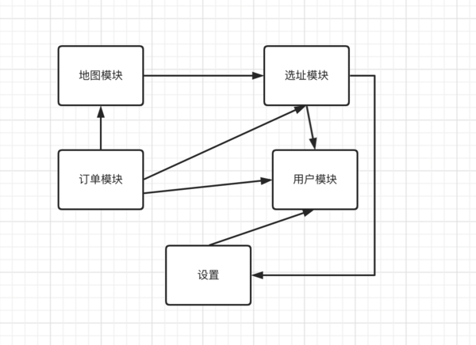
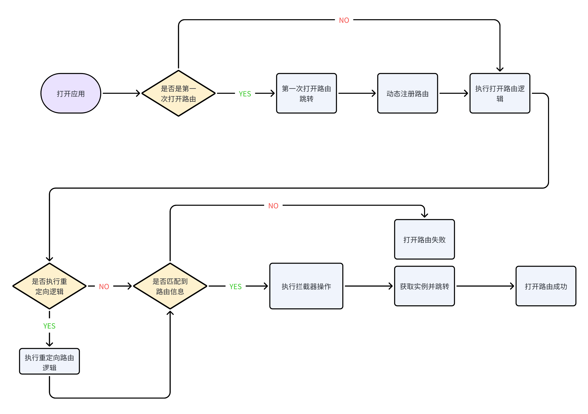
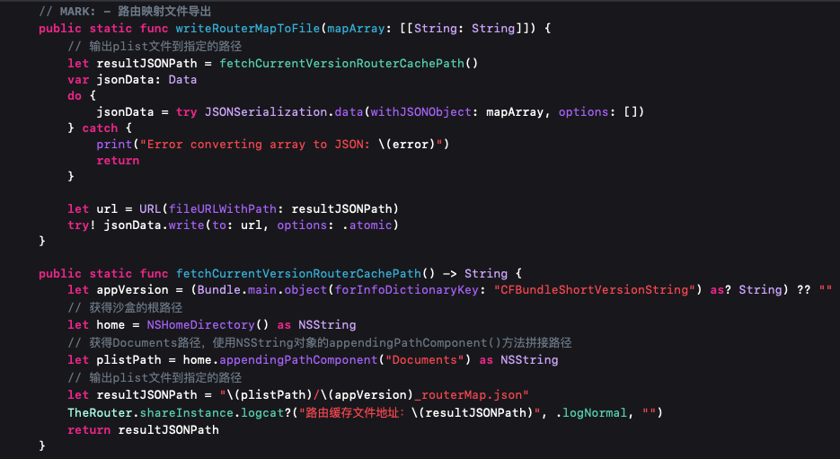
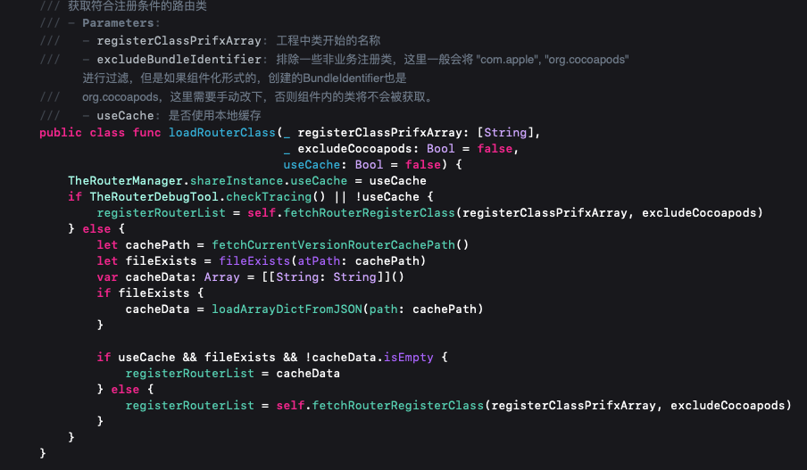
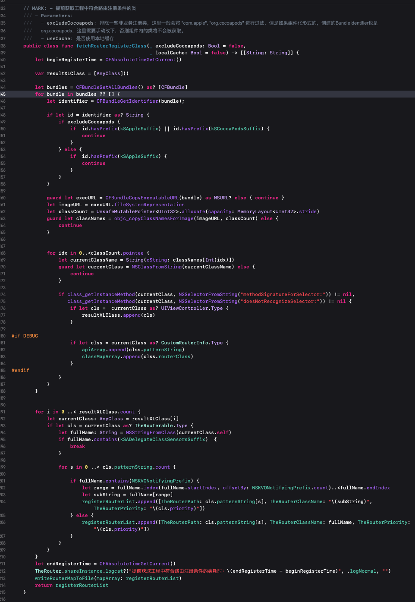

[](https://www.apache.org/licenses/LICENSE-2.0)
[]()
[]()
[](https://juejin.cn/user/1768489241815070)

iOS | [Android](https://github.com/HuolalaTech/hll-wp-therouter-android) | [中文官网](https://therouter.cn) | [英文官网](https://en.therouter.cn)

## 背景
  1. 随着社区对支持Swift的需求日益增多，Swift5.0二进制库也具有更好的稳定性和兼容性表现，货拉拉技术团队根据社区反馈及内部讨论，决定开源内部业务使用的Swift版本路由组件，与2023年8月份已发布的Objective-C版本路由组件组成一个完整解决方案。
  2. TheRouter开源团队将把重心放在维护和升级Swift版本的TheRouter上。同时也会持续支持Objective-C版本的易用性，并欢迎社区贡献。
  3. 对于使用Objective-C版本TheRouter的用户，建议将版本固定为1.0.0版以确保稳定性。
## Features
  TheRouter一个用于模块间解耦和通信，基于Swift协议进行动态懒加载注册路由与打开路由的工具。同时支持通过Service-Protocol寻找对应的模块，并用 protocol进行依赖注入和模块通信。
* **1. 页面导航跳转能力**：支持常规vc或Storyboard的push/present/popToTaget/windowNavRoot/modalDismissBeforePush跳转能力；
* **2. 路由自动注册能力**：懒加载方式动态注册路由，仅当第一次调用OpenURL时进行动态注册；
* **3. 路由映射文件导出**：支持将工程中的路由映射关系导出为文档，支持JSON、Plist格式，方便开发者进行双端的汇总比对、记录等；
* **4. 服务自动注册能力**：动态注册服务，使用runtime方式自动注入；
* **5. 硬编码消除**：将注册的path转为静态字符串常量供业务使用；
* **6. 动态化能力**：支持添加重定向，移除重定向、动态添加路由、动态移除路由、拦截器、错误path修复等；
* **7. 链式编程**：支持链式编程方式拼接URL与参数；
* **8. 适配Objective-C**：OC类可以实现TheRouterableProxy 协议即可，底层做了兼容；
* **9. 服务调用**：支持本地服务调用与远端服务调用；
* **10. 增加异步获取符合条件注册类**：遍历工程实现路由协议的类，并提前存储；
* **11. 增加路由本地缓存能力**：每次重启应用，需要重新走注册流程，增加根据版本号进行本地缓存能力，避免初次注册;
* **12. 自定义跳转逻辑实现**：解决类似RDVTabBarControlle也没有继承UITabbarController，导航栈也不同，那么就需要自己实现各种跳转逻辑;
* **13. 支持自动参数映射**：使用setValue:forKey动态根据参数对实例类进行赋值，无需手动赋值。支持闭包，可选型(需声明@objc);


| 功能序号 | 功能描述 | 事例代码及注释 |
|:----|:---:|:---:|
| 1 | 懒加载路由 | lazyRegisterRouterHandle  仅当第一次调用OpenURL时进行动态注册|
| 2 | 发挥Swift特性，面向协议编程 | TheRouterServiceProtocol TheRouterableProtocol |
| 3 | 动态注册，无需手动注册 | TheRouterManager.addGloableRouter(true, url, userInfo, forceCheckEnable: true) |
| 4 | 支持依赖注入与服务的自动注册 | TheRouter.registerServices()  TheRouterServiceManager.registerService(serviceName)|
| 5 | 服务的动态注册与协议方式调用| TheRouter.fetchService(AppConfigServiceProtocol.self) |
| 6 | 支持单模块独立初始化| ModuleProtocol moduleSetUp() |
| 7 | 支持路由映射文件导出 | TheRouter.writeRouterMapToFile |
| 8 | 支持重定向，移除重定向、动态添加路由、动态移除路由，错误path修复 | TheRouter.addRelocationHandle |
| 9 | 支持拦截器 | TheRouter.addRouterInterceptor |
| 10 | 支持Swift项目中调用OC路由 | OC类可以实现TheRouterableProxy 协议即可，底层做了兼容 |
| 11 | 支持全局失败监控 | TheRouter.globalOpenFailedHandler  |
| 12 | 支持路由与服务日志回调 | TheRouter.logcat(_ url: String, _ logType: TheRouterLogType, _ errorMsg: String)  |
| 13 | 支持路由注册期的安全检查 | TheRouterManager.routerForceRecheck()  客户端强制校验，是否匹配,不匹配触发断言|
| 14 | 支持后端对客户端服务的调用 | TheRouter.openURL() 服务接口下发，MQTT,JSBridge|
| 15 | 支持链式调用 | TheRouterBuilder.build("scheme://router/demo").withInt(key: "intValue", value: 2).navigation() |
| 16 | 支持链式调用打开路由回调闭包 | TheRouterBuilder.build("scheme://router/demo").withInt(key: "intValue", value: 2).navigation(_ complateHandler: ComplateHandler = nil) |
| 17 | 支持非链式调用打开路由回调闭包 | TheRouter.openURL("https://therouter.cn/" ) { param, instance in } |
| 18 | 增加异步获取符合条件注册类 | TheRouterManager.fetchRouterRegisterClass() |
| 19 | 增加路由本地缓存能力 | TheRouterManager.fetchRouterRegisterClass(excludeCocoapods: true, userCache: true) |

# 背景
随着项目需求的日益增加，开发人员的不断增加，带来了很多问题：

- 模块划分不清晰，任何开发人员随意调用并修改其他模块的代码实现以满足自己的业务需求。

- 维护困难，同一组件的不同服务，散落在工程各个地方，不利于统一维护修改替换。

- 模块负责人无法清晰，导致同一功能多人维护，造成冲突。



另外件拆分完之后都上升到远端，那么它们之间本地的代码是没办法相互依赖的，所以就需要通过一种工具，然后去实现透传服务的能力。我们需要一个中间件去处理这些问题。路由即是将耦合进行转移，通过增加中间层映射关系，解决业务之间的依赖关系。

## 一个成熟的路由该是什么样子

**1.**  业务组件化之后，组件化需要将整个项目的各个模块进行解耦，升级远端之后，界面之间的跳转怎么解决？**路由 Api**

**2.**  动态注册路由，无需手动注册。服务的动态注册，无需手动注册。

**3.**  端上跳转统一问题怎么解决？**使用统一 URL 映射方式处理**

**4.**  业务跳转中出现问题，如何修改跳转逻辑？服务如何降级? **远端下发配置，修改跳转 URL**

**5.**  业务服务异常，界面改为 h5 界面。**重定向**

**6.**  App 跳转出现问题如何跳转到同一个本地的 error 界面？**统一失败处理**

**7.**  如何在跳转前增加强制的业务逻辑处理，比如业务调整，必须先执行某些操作，才能进入。**重定向**

**8.**  业务中有很多需要前置跳转，比如先登录才能去订单列表，如何实现。**拦截器**

**9.**  如何测试各个跳转业务是否正常。 **路由 Path 校验**

**10.** 如何把最频繁的业务跳转前置，减少查询次数？**增加优先级 priority**

**11.** 本地服务通过路由调用，远端服务通过路由调用 **支持服务调用**

## 整体设计思路

为了和Android端保持一致，使用了URL，class注册的方式实现。通过URL匹配方式查询数组中保存的模版信息，找到执行获取对应实例，执行跳转操作。



## 使用介绍预览


## 使用讲解视频
 
TheRouteriOS讲解视频：<https://www.bilibili.com/video/BV1px4y1Y7mX>

## 注意事项

### 1. 为什么会有Demo中有TheRouterApi这个类，TheRouterApi中的类是必须写的嘛。
   在跨模块调用时，我们无法拿到其他模块具体的类信息，那么抽象的TheRouterApi就能实现跨模块调用了。这里增加这个类仅仅作为辅助打开路由工具类而已。如果你不用也是OK的，可以直接通过 `TheRouter.openURL("scheme://router/demo?id=2&value=3&name=AKyS")`打开路由即可。 
### 2. TheRouterApi不是注册时使用的，是跨模块调用时使用的。
    比如 `TheRouter.openURL(TheRouterLAApi().requiredURL)` 路由注册自动注册的，只需要实现TheRouterAble协议即可。
### 3. forceCheckEnable具体含义。

    强制打开TheRouterApi定义的便捷类与实现TheRouterAble协议类是否相同，打开的话，debug环境会自动检测，避免线上出问题，建议打开.这里都有开关，如果你觉得没必要，改为false即可，但是需要你自己讲所有跳转的地方都自己测试一遍，看看有没有失败的，当然失败在debug下会触发断言的。


## 注意事项

### 1. 为什么会有Demo中有TheRouterApi这个类，TheRouterApi中的类是必须写的嘛。
   在跨模块调用时，我们无法拿到其他模块具体的类信息，那么抽象的TheRouterApi就能实现跨模块调用了。这里增加这个类仅仅作为辅助打开路由工具类而已。如果你不用也是OK的，可以直接通过 `TheRouter.openURL("scheme://router/demo?id=2&value=3&name=AKyS")`打开路由即可。 
### 2. TheRouterApi不是注册时使用的，是跨模块调用时使用的。
    比如 `TheRouter.openURL(TheRouterLAApi().requiredURL)` 路由注册自动注册的，只需要实现TheRouterAble协议即可。
### 3. forceCheckEnable具体含义。

    强制打开TheRouterApi定义的便捷类与实现TheRouterAble协议类是否相同，打开的话，debug环境会自动检测，避免线上出问题，建议打开.这里都有开关，如果你觉得没必要，改为false即可，但是需要你自己讲所有跳转的地方都自己测试一遍，看看有没有失败的，当然失败在debug下会触发断言的。


## 注意事项

### 1. 为什么会有Demo中有TheRouterApi这个类，TheRouterApi中的类是必须写的嘛。
   在跨模块调用时，我们无法拿到其他模块具体的类信息，那么抽象的TheRouterApi就能实现跨模块调用了。这里增加这个类仅仅作为辅助打开路由工具类而已。如果你不用也是OK的，可以直接通过 `TheRouter.openURL("scheme://router/demo?id=2&value=3&name=AKyS")`打开路由即可。 
### 2. TheRouterApi不是注册时使用的，是跨模块调用时使用的。
    比如 `TheRouter.openURL(TheRouterLAApi().requiredURL)` 路由注册自动注册的，只需要实现TheRouterAble协议即可。
### 3. forceCheckEnable具体含义。

    强制打开TheRouterApi定义的便捷类与实现TheRouterAble协议类是否相同，打开的话，debug环境会自动检测，避免线上出问题，建议打开.这里都有开关，如果你觉得没必要，改为false即可，但是需要你自己讲所有跳转的地方都自己测试一遍，看看有没有失败的，当然失败在debug下会触发断言的。

## 如何集成使用

### [CocoaPods](https://cocoapods.org)
Add the following entry in your Podfile:

```ruby
   pod 'TheRouter', '1.1.8'
```

## Swift限制版本

```ruby
 Swift5.0 or above
```

## TheRouter 使用方式


### 路由组件初始化

```Swift

// 日志回调，可以监控线上路由运行情况
TheRouter.logcat { url, logType, errorMsg in
    debugPrint("TheRouter: logMsg- \(url) \(logType.rawValue) \(errorMsg)")
}

//类似RDVTabBarControlle也没有继承UITabbarController，导航栈也不同，那么就需要自己实现各种跳转逻辑
// TheRouter.customJumpAction { jumpType, instance in
  
// }

// 路由懒加载注册,
// - excludeCocoapods: 是否对Cocoapods生成的组件进行动态注册
// - excludeCocoapods = true 不对Cocoapods生成的组件进行动态注册， false 对Cocoapods生成的组件也进行遍历动态注册
// - useCache: 是否开启本地缓存功能
 // 提前获取需要注册的路由并缓存本地  The 其实就是工程统一类名前缀，比如demo中的TheRouter.TheRouterController
TheRouterManager.loadRouterClass(excludeCocoapods: true, useCache: true)

TheRouter.lazyRegisterRouterHandle { url, userInfo in
    TheRouterManager.injectRouterServiceConfig(webRouterUrl, serivceHost)
    /// - Parameters:
    ///   - excludeCocoapods: 排除一些非业务注册类，这里一般会将 "com.apple", "org.cocoapods" 进行过滤，但是如果组件化形式的，创建的BundleIdentifier也是
    ///   org.cocoapods，这里需要手动改下，否则组件内的类将不会被获取。
    ///   - urlPath: 将要打开的路由path
    ///   - userInfo: 路由传递的参数
    ///   - forceCheckEnable: 是否支持强制校验，强制校验要求Api声明与对应的类必须实现TheRouterAble协议
    ///   - forceCheckEnable 强制打开TheRouterApi定义的便捷类与实现TheRouterAble协议类是否相同，打开的话，debug环境会自动检测，避免线上出问题，建议打开
    return TheRouterManager.addGloableRouter(true, url, userInfo, forceCheckEnable: true)
}

// 动态注册服务
TheRouterManager.registerServices(excludeCocoapods: false)
```

### 路由注册

#### 自动化注册
 鉴于已经实现了自动注册能力，开发者无需自己添加路由，只需要控制器实现TheRouterable协议即可。当然你想手动注册路由也可以。
 
```Swift
/// 实现TheRouterable协议
extension TheRouterController: TheRouterable {
    
    static var patternString: [String] {
        ["scheme://router/demo"]
    }
}
```

#### 手动单个注册

```Swift
// 模型模式
TheRouter.addRouterItem(RouteItem(path: "scheme://router/demo?&desc=简单注册,直接调用TheRouter.addRouterItem()注册即可", className: "TheRouter_Example.TheRouterController", desc: "简单注册,直接调用TheRouter", params: ["key1": 1]))
// 字典模式
TheRouter.addRouterItem(["scheme://router/demo?&desc=简单注册,直接调用TheRouter.addRouterItem()注册即可": "TheRouter_Example.TheRouterController"])
// 常量参数模式
TheRouter.addRouterItem("scheme://router/demo?&desc=简单注册", classString: "TheRouter_Example.TheRouterController")
// 协议模式， TheRouterApi实现了 CustomRouterInfo协议
TheRouter.addRouterItem(TheRouterApi.patternString, classString: TheRouterApi.routerClass)
```

#### 手动批量注册

```Swift
TheRouter.addRouterItem(["scheme://router/demo": "TheRouter_Example.TheRouterController",
                    "scheme://router/demo1": "TheRouter_Example.TheRouterControllerA"])
```

### 路由打开

声明了不同的方法，主要用于明显的区分，内部统一调用 openURL


#### 打开路由方式一 垮组件进行调用，使用中间层Api,不依赖其他模块

比如将实现了CustomRouterInfo协议的类放在远端作为底层基础模块，供其他模块调用。

```Swift
public class TheRouterApi: CustomRouterInfo {

    public static var patternString = "scheme://router/demo"
    public static var routerClass = "TheRouter_Example.TheRouterController"
    public var params: [String: Any] { return [:] }
    public var jumpType: LAJumpType = .push

    public init() {}
}

public class TheRouterAApi: CustomRouterInfo {

    public static var patternString = "scheme://router/demo1"
    public static var routerClass = "TheRouter_Example.TheRouterControllerA"
    public var params: [String: Any] { return [:] }
    public var jumpType: LAJumpType = .push

    public init() {}
}

TheRouter.openURL(TheRouterApi.init().requiredURL)
TheRouter.openURL(TheRouterAApi.init().requiredURL)
```

底层自动注册，涉及到NSClassFromString，在Swift中的使用方式与OC是有区别，并不像OC可以直接往NSClassFromString()放入字符串类型的类名即可，Swift这样是找不到的。
swift中由于命名空间的存在，如果还用上面的方法通过字符串动态的创建类是不可以的（得到的会是空）。swift通过字符串动态的创建类我们需要在字符串的前面加上命名空间. 

#### 打开路由方式二 - scheme+paths+params

```Swift
TheRouter.openURL("scheme://router/demo9?desc=缓存跳转")
```

#### 打开路由方式三 - web打开，URL作为参数传递

```Swift
TheRouter.openWebURL("https://xxxxxxxx")
```

#### 打开路由方式四- 便利构造器链式打开路由

```Swift
let model = TheRouterModel.init(name: "AKyS", age: 18)
TheRouterBuilder.build("scheme://router/demo")
    .withInt(key: "intValue", value: 2)
    .withString(key: "stringValue", value: "2222")
    .withFloat(key: "floatValue", value: 3.1415)
    .withBool(key: "boolValue", value: false)
    .withDouble(key: "doubleValue", value: 2.0)
    .withAny(key: "any", value: model)
    .navigation()
    
TheRouterBuilder.build("scheme://router/demo")
.withInt(key: "intValue", value: 2)
.withString(key: "stringValue", value: "sdsd")
.withFloat(key: "floatValue", value: 3.1415)
.withBool(key: "boolValue", value: false)
.withDouble(key: "doubleValue", value: 2.0)
.withAny(key: "any", value: model)
.navigation { params, instance in
    
}
```
### 路由参数如何传递

#### 1. 元祖形式传入路由与追加参数

```Swift
TheRouter.openURL(("scheme://router/demo1?id=2&value=3&name=AKyS&desc=直接调用TheRouter.addRouterItem()注册即可，支持单个注册，批量注册，动态注册，懒加载动态注册", ["descs": "追加参数"]))
```

#### 2.参数传递方式
为了同时支持OC与Swift，这里使用了包装类进行闭包的传递 TheRouerParamsClosureWrapper。

```Swift
let wrapper = TheRouerParamsClosureWrapper { params in
    print("Received params: \(params)")
}
TheRouter.openURL(("scheme://router/demo1?id=2&value=3&name=AKyS&desc=直接调用TheRouter.addRouterItem()注册即可，支持单个注册，批量注册字典形式，动态注册TheRouterManager.addGloableRouter，懒加载动态注册 TheRouter.lazyRegisterRouterHandle ",["qrResultCallBack": wrapper]))
```
#### 3. 使用实现了CustomRouterInfo协议的对象进行传递

params 即为封装的传递参数
```Swift
public class TheRouterC3Api: NSObject, CustomRouterInfo {
    
    public static var patternString = "scheme://router/demo3"
    public static var routerClass = "TheRouter_Example.TheRouterControllerC"
    public var params: [String: Any] { return ["desc":"如果直接调用TheRouterCApi进行路由跳转，此时路由地址demo33是错误的，无法进行跳转，触发断言，仅当动态下发修复之后才能跳转，测试可以注释TheRouterManager.addRelocationHandle这行代码"] }
    public var jumpType: LAJumpType = .push
    
    public override init() {}
}

TheRouter.openURL(TheRouterC3Api.init().requiredURL)
```

### 全局失败映射

```Swift
TheRouter.globalOpenFailedHandler { info in
   debugPrint(info)
}
```

### 拦截

比如在未登录情况下统一拦截：跳转消息列表之前先去登录，登录成功之后跳转到消息列表等。

```Swift
let login = TheRouterLoginApi.templateString
 TheRouter.addRouterInterceptor([login], priority: 0) { (info) -> Bool in
       if LALoginManger.shared.isLogin {
             return true
       } else {
             TheRouter.openURL(TheRouterLoginApi().build)
             return false
       }
 }
```

登录成功之后删除拦截器即可。

### 路由移除

```Swift
TheRouter.removeRouter(TheRouterViewCApi.patternString)
```

### 如何让 OC 类也享受到 Swift 路由

这是一个 OC 类的界面，实现路由的跳转需要实现 TheRouterableProxy 协议即可。当子类TheRouterBaseViewController实现了默认的协议后，子类只需要重写patternString方法

```Swift
@interface TheRouterBController : TheRouterBaseViewController
@property (nonatomic, strong) UILabel *desLabel;
@end

@interface TheRouterBController ()

@end

@implementation TheRouterBController

- (void)viewDidLoad {
    [super viewDidLoad];
    self.view.backgroundColor = [UIColor yellowColor];
    [self.view addSubview:self.desLabel];
    // Do any additional setup after loading the view.
}

// 实现协议中的类方法
+ (NSArray<NSString *> *)patternString {
    return @[@"scheme://router/demo2"];
}

@end
```


### 路由根据版本号缓存能力





增加缓存能力，同一版本再次打开无需走初次加载流程，直接读缓存注册，提升效率。
考虑到开发中同一个版本下会有新增路由情况，那么从缓存读取就是不正确的，导致无法跳转。我们做了逻辑优化，如果当前正在链接Xcode跑起来的应用，会默认不走缓存，仅当打出包情况下走缓存逻辑。

## 支持TabBar跳转

```Swift

TheRouter.openURL("scheme://router/tabbar?jumpType=5&tabBarSelecIndex=1")

[TheRouerBridge openURL:@"scheme://router/tabbar?jumpType=5" userInfo:@{TheRouterTabBarSelecIndex: @1} complateHandler:^(NSDictionary<NSString *,id> *  queries, UIViewController * resultVC) {
            
}];
```
## 服务的动态注册与调用

### 如何声明服务及实现服务

```Swift
@objc
public protocol AppConfigServiceProtocol: TheRouterServiceProtocol {
    // 打开小程序
    func openMiniProgram(info: [String: Any])
}

final class ConfigModuleService: NSObject, AppConfigServiceProtocol {
    
    static var seriverName: String {
        String(describing: AppConfigServiceProtocol.self)
    }
    
    func openMiniProgram(info: [String : Any]) {
        if let window = UIApplication.shared.delegate?.window {
            window?.makeToast("打开微信小程序", duration: 1, position: window?.center)
        }
    }
}


```
### 如何使用服务

```Swift
/// 使用方式
 if let appConfigService = TheRouter.fetchService(AppConfigServiceProtocol.self){
     appConfigService.openMiniProgram(info: [:])
}
```

 服务使用了runtime动态注册，所以你不用担心服务没有注册的问题。只需像上述案例一样使用即可。
 
 

### 路由远端调用本地服务：服务接口下发，MQTT,JSBridge

```Swift
let dict = ["ivar1": ["key":"value"]]
let url = "scheme://services?protocol=AppConfigLAServiceProtocol&method=openMiniProgramWithInfo:&resultType=0"
TheRouter.openURL((url, dict))
```

## 动态调用路由

在之上的路由能力下，我们希望 App 能够支持动态增加路由，删除路由，重定向路由、通过路由调起本地服务、远端通过路由调起 App 服务能力，随即进行了动态化的扩展。

### 重定向功能
定义路由下发模型数据结构

```Swift
public struct TheRouterInfo {
    public init() {}
    
    public var targetPath: String = ""
    public var orginPath: String = ""
    // 1: 表示替换或者修复客户端代码path错误 2: 新增路由path 3:删除路由
    public var routerType: TheRouterReloadMapEnum = .none 
    public var path: String = "" // 新的路由地址
    public var className: String = "" // 路由地址对应的界面
    public var params: [String: Any] = [:]
}
```

通过远端下发重定向数据，原本跳转到白色界面的业务逻辑改为跳转到黄色界面

```Swift
let relocationMap = ["routerType": 1, "targetPath": "scheme://router/demo1", "orginPath": "scheme://router/demo"] as NSDictionary
TheRouterManager.addRelocationHandle(routerMapList: [relocationMap])
TheRouter.openURL("scheme://router/demo?desc=跳转白色界面被重定向到了黄色界面")
```

### 重定向恢复

在业务中，通常会进行业务调整，那么重定向之后需要恢复的话，就需要移除重定向

```Swift
let relocationMap = ["routerType": 4, "targetPath": "scheme://router/demo", "orginPath": "scheme://router/demo"] as NSDictionary
TheRouterManager.addRelocationHandle(routerMapList: [relocationMap])
TheRouter.openURL("scheme://router/demo?desc=跳转白色界面被重定向到了黄色界面之后，根据下发数据又恢复到跳转白色界面")
```

### 路由 Path 动态修复

在实际开发中，开发人员因为马虎写错了路由 Path，上线之后无法进行正常的业务跳转，此时就需要通过远端下发路由进行匹配跳转了。scheme://router/demo3 是正确 path,但是本地写错的路由 path 为 scheme://router/demo33，那么需要新增一个 path 进行映射。

```Swift
let relocationMap = ["routerType": 2, "className": "TheRouter_Example.TheRouterControllerC", "path": "scheme://router/demo33"] as NSDictionary
TheRouterManager.addRelocationHandle(routerMapList: [relocationMap])
let value = TheRouterCApi.init().requiredURL
TheRouter.openURL(value)
```

### 路由适配不同的 Android-Path

在实际开发中，一旦使用 URI 这种方式，牵扯到双端，就可以存在双端不一致的问题，那么如何解决呢，可以通过本地新增多路由 path 解决，也可以通过远端下发新路由解决。

```Swift
public class TheRouterControllerB: TheRouterBController, TheRouterable {

    public static var patternString: [String] {
        ["scheme://router/demo2",
         "scheme://router/demo2Android"]
    }
}
```

```Swift
let relocationMap = ["routerType": 2, "className": "TheRouter_Example.TheRouterControllerD", "path": "scheme://router/demo5"] as NSDictionary
TheRouterManager.addRelocationHandle(routerMapList: [relocationMap])
TheRouter.openURL("scheme://router/demo2Android?desc=demo5是Android一个界面的path,为了双端统一，我们动态增加一个path,这样远端下发时demo5也就能跳转了")
```

## 实现如上功能的细节介绍

#### OC注解的形式

 这里列举了OC使用注解的方式，Swift因为其缺乏动态性，是不支持注解的。
 
```Objective-C
//使用注解
@page(@"home/main")
- (UIViewController *)homePage{
    // Do stuff...
}
```

#### Swift 注册形式
 
Swift 中，我们都知道 Swift 是不支持注解的，那么 Swift 动态注册路由该怎么解决呢，我们使用 runtime 遍历工程自建类的方式找到遵循了路由协议的类进行自动注册。自动排除系统类进行遍历，提高效率。



为了避免无效遍历，我们通过传入 registerClassPrifxArray 指定我们遍历包含这些前缀的类即可。一旦是 UIViewController.Type 类型就进行存储，然后再进行校验是否遵循 TheRouterable 协议，遵循则自动注册。无需手动注册。

使用 objc_copyClassNamesForImage 方法查找对应的类，比 objc_getClassList 遍历效率更高。 

新增了 org.cocoapods 过滤，考虑到组件化场景下，将会改为外部配置的方式传入。需要开发人员将自建的私有库bundleId修改为不是 org.cocoapods即可。

具体查看网址如下：

[路由性能优化讨论](https://github.com/HuolalaTech/hll-wp-therouter-ios/issues/9)

#### 路由注册的懒加载

采用动态注册有一个不好的情况就是在启动时就去动态注册，在 TheRouter 中注册的时机被延后了，放在了 App 第一次通过 TheRouter.openUrl()时进行注册，会判断路由是否加载完毕，未加载完毕进行加载，然后打开路由。

```Swift
@discardableResult
public class func openURL(_ urlString: String, userInfo: [String: Any] = [String: Any](), handler: complateHandler = nil) -> Any? {
    if urlString.isEmpty {
        return nil
    }
    if !shareInstance.isLoaded {
        return shareInstance.lazyRegisterHandleBlock?(urlString, userInfo)
    } else {
       return openCacheRouter((urlString, userInfo))
    }
}

// MARK: - Public method
@discardableResult
public class func openURL(_ uriTuple: (String, [String: Any]), handler: complateHandler = nil) -> Any? {
    if !shareInstance.isLoaded {
        return shareInstance.lazyRegisterHandleBlock?(uriTuple.0, uriTuple.1)
    } else {
        return openCacheRouter(uriTuple)
    }
}

public class func openCacheRouter(_ uriTuple: (String, [String: Any]), handler: complateHandler = nil) -> Any? {

    if uriTuple.0.isEmpty {
        return nil
    }

    if uriTuple.0.contains(shareInstance.serviceHost) {
        return routerService(uriTuple)
    } else {
        return routerJump(uriTuple)
    }
}
```


#### 路由 Path 与类正确安全校验

为了避免线上出现问题，这里使用了强制的匹配，要求实现CustomRouterInfo协议的类与实现TheRouterable协议的类数量保持一致。不一致直接触发断言。

```Swift
// MARK: - 客户端强制校验，是否匹配
public static func routerForceRecheck() {
    let patternArray = Set(pagePathMap.keys)
    let apiPathArray = Set(apiArray)
    let diffArray = patternArray.symmetricDifference(apiPathArray)
    debugPrint("URL差集：\(diffArray)")
    debugPrint("pagePathMap：\(pagePathMap)")
    assert(diffArray.count == 0, "URL 拼写错误，请确认差集中的url是否匹配")

    let patternValueArray = Set(pagePathMap.values)
    let classPathArray = Set(classMapArray)
    let diffClassesArray = patternValueArray.symmetricDifference(classPathArray)
    debugPrint("classes差集：\(diffClassesArray)")
    assert(diffClassesArray.count == 0, "classes 拼写错误，请确认差集中的class是否匹配")
}
```

#### 踩坑路由注册-KVO

在进行 classes 本地校验时遇到了类名不匹配问题。

排查原因： 是因为为了避免路由在启动时就注册，影响启动速度，采用了懒加载的方式即第一次打开路由界面的时候才先进行注册然后跳转。但是在我们动态注册之前，某个类因为添加了 KVO (Key-Value Observing 键值监听)，这个类在遍历时 className 修改为了 NSKVONotifying_xxx。需要我们进行特殊处理，如下

```Swift
/// 对于KVO监听，动态创建子类，需要特殊处理
public let NSKVONotifyingPrefix = "NSKVONotifying_"

if fullName.hasPrefix(NSKVONotifyingPrefix) {
    let range = fullName.index(fullName.startIndex, offsetBy: NSKVONotifyingPrefix.count)..<fullName.endIndex
    let subString = fullName[range]
    pagePathMap[cls.patternString[s]] = "\(subString)"
    TheRouter.addRouterItem(cls.patternString[s], classString: "\(subString)")
}
```

## 是否考虑Swift5.9 Macros？

 从目前的实现方式来看，懒加载加上动态注册，已经解决了注册时的性能问题。已经提前获取处理注册然后处理相关逻辑。当然，不排除会支持。
 
```Swift
/// 实现TheRouterable协议
extension TheRouterController: TheRouterable {
    
    static var patternString: [String] {
        ["scheme://router/demo"]
    }
}
```
## 关于作者

[货拉拉移动端技术团队](https://juejin.cn/user/1768489241815070)

## 开源协议

TheRouter 采用Apache2.0协议，详情参考[LICENSE](LICENSE)

## 交流沟通群
 鉴于群二维码一周就过期，直接添加个人微信，备注来意直接拉群里。

