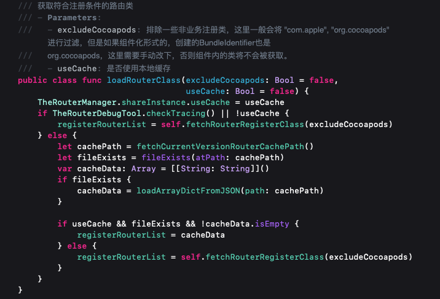
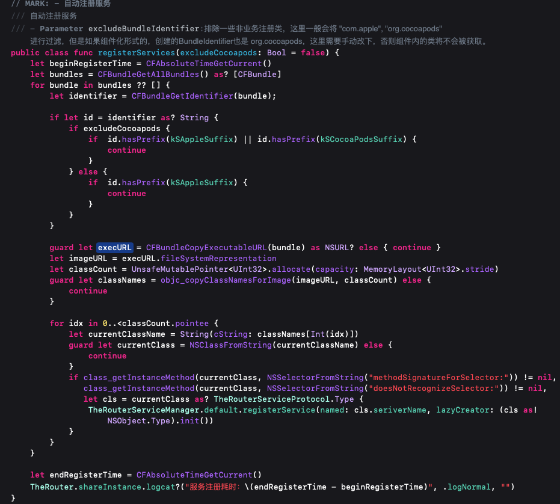

# TheRouter

[](https://www.apache.org/licenses/LICENSE-2.0)
[]()
[]()
[](https://xxx.com)

> [Chinese Documentation](README_CN.md)

## Background

1. With the increasing demand from the community to support Swift, the Swift 5.0 binary library also has better stability and compatibility performance. Based on community feedback and internal discussions, the Huolala technical team has decided to use the Swift version routing component for open source internal business, which will form a complete iOS solution with the Objective-C version routing component released in August 2023.

2. The TheRouter open-source team will focus on maintaining and upgrading the Swift version of TheRouter. At the same time, it will continue to support the ease of use of the Objective-C version, and welcomes community contributions.

3. For users using the Objective-C version of The Router, it is recommended to fix the version to version 1.0.0 to ensure stability.

## Features

TheRouter: A tool for decoupling and communication between modules, registering routes and opening routes based on the Swift protocol for dynamic lazy loading. 
In addition, it supports finding corresponding modules through Service-Protocol, and using protocol for dependency injection and module communication.

* **1. Page navigation jump ability:**  support regular vc or Storyboard push/present/popToTaget/windowNavRoot/modalDismissBeforePush jump ability;
* **2. Automatic registration router capability:**  Lazy load dynamic registration route, only when the first call OpenURL dynamic registration;
* **3. Export Route Mapping File:** Support exporting the routing mapping relationships in the project as documents, support JSON and Plist formats, and facilitate developers to perform dual end summary, comparison, and recording;
* **4. Automatic registration services capability:** dynamic registration of services, automatic injection using runtime;
* **5. Hard-coded elimination:**  Converts the registered path to a static string constant for business use;
* **6. Dynamic capability:**  Support to add emphasis direction, remove redirection, dynamic add route, dynamic remove route, interceptor, error path repair, etc.
* **7. Chain programming:**  Support chain programming to concatenate urls and parameters;
* **8. Adaptation Objective-C** : OC classes can dynamically register in Swift using inheritance to follow the protocol.
* **9. Service call:**  Support local service call and remote service call;
* **10. Added asynchronous acquisition of eligible registration classes**: Find classes that implement routing protocols in projects and store them in advance;
* **11. Added routing local server capability**: Every time you restart the application, you need to go through the registration process again. Added local server capability based on version number to avoid initial registration;

| number | desc | instanceCode |
|:----|:---:|:---:|
| 1 | Supports Lazy loading route | lazyRegisterRouterHandle  Dynamic registration only occurs when OpenURL is first called|
| 2 | Supports Utilize Swift features for protocol oriented programming | TheRouterServiceProtocol TheRouterableProtocol |
| 3 | Supports Dynamic registration without manual registration | TheRouterManager.addGloableRouter([".LA"], url, userInfo) |
| 4 | Support for dependency injection and automatic registration of services | TheRouter.registerServices()  TheRouterServiceManager.registerService(serviceName)|
| 5 | Supports Dynamic registration and protocol invocation of services | TheRouter.fetchService(AppConfigServiceProtocol.self) |
| 6 | Supports independent initialization of a single module | ModuleProtocol moduleSetUp() |
| 7 | Support for exporting routing mapping files | TheRouter.writeRouterMapToFile |
| 8 | Support redirection, remove redirection, dynamically add routes, dynamically remove routes, and fix error paths | TheRouter.addRelocationHandle |
| 9 | Support interceptors | TheRouter.addRouterInterceptor |
| 10 | Support calling OC route in Swift project | OC classes can be dynamically registered in Swift using inheritance to follow protocols|
| 11 | Support for global failure monitoring | TheRouter.globalOpenFailedHandler  |
| 12 | Support for routing and service log callback | TheRouter.logcat(_ url: String, _ logType: TheRouterLogType, _ errorMsg: String)  |
| 13 | Support security checks during route registration period | TheRouterManager.routerForceRecheck()  Client mandatory verification, whether it matches, triggering assertion if it does not match |
| 14 | Support backend calls to client services | TheRouter.openURL() Service interface distribution，MQTT,JSBridge|
| 15 | Support for chain calling| TheRouterBuilder.build("scheme://router/demo").withInt(key: "intValue", value: 2).navigation() |
| 16 | Supports opening routing callback closures | TheRouterBuilder.build("scheme://router/demo").withInt(key: "intValue", value: 2).navigation(_ complateHandler: ComplateHandler = nil) |
| 17 | Support non chain calling to open routing callback closures | TheRouter.openURL("https://therouter.cn/" ) { param, instance in } |
| 18 | Add asynchronous retrieval of qualified registration classes | TheRouterManager.fetchRouterRegisterClass() |
| 19 | Increase route local caching capability | TheRouterManager.fetchRouterRegisterClass([.The], userCache: true) |

# Background

With the increasing demand of the project, the increasing number of developers has brought many problems:

- The module division is not clear, and any developer will call and modify the code implementation of other modules to meet their own business needs.

- Difficult maintenance. Different services of the same component are scattered in different parts of the project, which is not conducive to unified maintenance, modification and replacement.

- Module owner cannot be clear, resulting in multiple maintenance of the same function, resulting in conflict.


After the other pieces are split up to the remote side, then the local code between them is not able to rely on each other, so it is necessary to pass a tool, and then to achieve the ability of transparent service. We need a middleware to handle these issues. Routing transfers the coupling and solves the dependency between services by adding an intermediate layer mapping relationship.

What does a mature route look like

1. After service componentization, each module of the whole project needs to be decoupled. After upgrading the remote end, how to solve the jump between interfaces? ``Routing Api``

2. Dynamically register routes. Manual registration is not required. Dynamic registration of services without manual registration.

3. What is the solution to the uphop unification problem? ``Uses unified URL mapping to process``

4. If a fault occurs during service forwarding, how can I modify the service forwarding logic? How can services be degraded? ``Remote delivery configuration, modified the forward URL``

5. The service is abnormal, and the h5 interface is displayed. ``Redirect``

6. If the App redirection fails, how can I go to the same local error page? ``Unified failure handling``

7. How to add forced business logic processing before the jump, such as service adjustment, you must perform some operations before entering. ``Redirect``

8. There are a lot of pre-hops in the business, such as login before you can go to the order list. How to achieve this? ``Interceptor``

9. How to test whether each forward service is normal? ``Route Path verification``

10. How to put the most frequent service forward to reduce the number of queries? ``Increase priority``

11. The local service is called through the route, and the remote service is called through the route ``Support service call``

## Overall design idea

In order to keep consistent with the Android side, the URL and class registration are used to achieve. Query the template information saved in the array by URL matching, find and obtain the corresponding instance, and perform the jump operation.


## Use intro preview


## How to install

### [CocoaPods](https://cocoapods.org)
Add the following entry in your Podfile:

```ruby
   pod 'TheRouter', '1.1.4'
```

## Swift Restricted version

```ruby
 Swift5.0 or above
```

## TheRouter usage

1. ### Sign up

Since automatic registration capabilities have been implemented, developers do not need to add routes themselves, just do the following.

```Swift
/// 实现TheRouterable协议
extension TheRouterController: TheRouterable {
   
   static var patternString: [String] {
       ["scheme://router/demo"]
   }
   
   static func registerAction(info: [String : Any]) -> Any {
       debugPrint(info)
       
       let vc =  TheRouterController()
       vc.qrResultCallBack = info["clouse"] as? QrScanResultCallBack
       vc.resultLabel.text = info.description
       return vc
   }

   static var priority: UInt {
       TheRouterDefaultPriority
   }
}

// 日志回调，可以监控线上路由运行情况
TheRouter.logcat { url, logType, errorMsg in
    debugPrint("TheRouter: logMsg- \(url) \(logType.rawValue) \(errorMsg)")
}

 // 提前获取需要注册的路由并缓存本地  The 其实就是工程统一类名前缀，比如demo中的TheRouter.TheRouterController
TheRouterManager.loadRouterClass([".The"], useCache: true)

// 当调用openUrl时，第一次会回调到这里进行路由的注册，这个不能注释
TheRouter.lazyRegisterRouterHandle { url, userInfo in
    // injectRouterServiceConfig 打开H5,远程服务调用使用
    TheRouterManager.injectRouterServiceConfig(webRouterUrl, serivceHost)
    return TheRouterManager.addGloableRouter([".The"], true, url, userInfo)
}

// 动态注册服务
TheRouterManager.registerServices(excludeCocoapods: false)
```

 #### OC The form of the annotation
 Here is a list of the ways OC uses annotations, which Swift does not support due to its lack of dynamism.

```Swift
//使用注解
@page(@"home/main")
- (UIViewController *)homePage{
    // Do stuff...
}
```

#### Swift registered routing
In Swift, we all know that Swift does not support annotations, so how to solve the problem of dynamic registration routing in Swift? 

We use the runtime to traverse the self-built classes of the project to find the classes that follow the routing protocol and automatically register them. Automatically exclude system classes for traversal to improve efficiency.


In order to avoid invalidity, we can specify that we traverse the classes containing these associations by looking up registerClassPrifxArray. Once it is of type UIViewController.Type, it is stored, and then verified whether it follows the TheRouterable protocol. If it follows, it will be automatically registered. No need to register manually.

Use the objc_copyClassNamesForImage method to find the corresponding class, which is more efficient than objc_getClassList traversal.

Added org.cocoapods filtering, taking into account the componentization scenario, it is determined by external configuration. Developers need to modify the ID of the self-built tree library bundle to be other than org.cocoapods.

The specific viewing URL is as follows:

[Routing performance optimization discussion](https://github.com/HuolalaTech/hll-wp-therouter-ios/issues/9)

## Route cache capability based on version number




Increased caching capabilities, the same version can be opened again without going through the initial loading process, and the cache registration can be read directly to improve efficiency.

Considering that there will be new routes under the same version during development, reading from the cache will be incorrect, resulting in an inability to jump. We have made logic optimization. 

If the application is currently linked to Xcode and run, the cache will not be used by default, and the caching logic will only be used when outsourcing the package.

#### Lazy load of route registration
 A bad thing about dynamic registration is that it is dynamically registered at startup. 
 The time for registering in TheRouter is delayed and it is registered when the App passes TheRouter.openURL () for the first time. 
 It will determine whether the route has been loaded, load it if not, and then open the route.

```Swift
@discardableResult
public class func openURL(_ urlString: String, userInfo: [String: Any] = [String: Any]()) -> Any? {
    if urlString.isEmpty {
        return nil
    }
    if !shareInstance.isLoaded {
        return shareInstance.lazyRegisterHandleBlock?(urlString, userInfo)
    } else {
       return openCacheRouter((urlString, userInfo))
    }
}

// MARK: - Public method
@discardableResult
public class func openURL(_ uriTuple: (String, [String: Any])) -> Any? {
    if !shareInstance.isLoaded {
        return shareInstance.lazyRegisterHandleBlock?(uriTuple.0, uriTuple.1)
    } else {
        return openCacheRouter(uriTuple)
    }
}

public class func openCacheRouter(_ uriTuple: (String, [String: Any])) -> Any? {

    if uriTuple.0.isEmpty {
        return nil
    }

    if uriTuple.0.contains(shareInstance.serviceHost) {
        return routerService(uriTuple)
    } else {
        return routerJump(uriTuple)
    }
}
```
#### How can OC classes also enjoy Swift routes
This is an OC class interface, the implementation of the route jump needs to inherit OC class, and implement the TheRouterAble protocol

```Swift
@interface TheRouterBController : UIViewController
@property (nonatomic, strong) UILabel *desLabel;
@end

@interface TheRouterBController ()

@end

@implementation TheRouterBController

- (void)viewDidLoad {
    [super viewDidLoad];
    self.view.backgroundColor = [UIColor yellowColor];
    [self.view addSubview:self.desLabel];
    // Do any additional setup after loading the view.
}
@end

public class TheRouterControllerB: TheRouterBController, TheRouterable {

    public static var patternString: [String] {
        ["scheme://router/demo2",
         "scheme://router/demo2-Android"]
    }

    public static func registerAction(info: [String : Any]) -> Any {
        let vc =  TheRouterBController()
        vc.desLabel.text = info.description
        return vc
    }
}
```


#### Individual registration

```Swift

TheRouter.addRouterItem(RouteItem(path: "scheme://router/demo?&desc=简单注册,直接调用TheRouter.addRouterItem()注册即可", className: "TheRouter_Example.TheRouterController"))

TheRouter.addRouterItem(["scheme://router/demo?&desc= Simple registration, directly call TheRouter.addRouterItem() registration ": "TheRouter_Example.TheRouterController"])

TheRouter.addRouterItem("scheme://router/demo? & desc = simple registration ", classString: "TheRouter_Example. TheRouterController")

TheRouter.addRouterItem(TheRouterApi.patternString, classString: TheRouterApi.routerClass)

TheRouter.addRouterItem(TheRouterAApi.patternString, classString: TheRouterAApi.routerClass)
```

#### Bulk registration

```Swift
TheRouter.addRouterItem(["scheme://router/demo": "TheRouter_Example.TheRouterController",
                    "scheme://router/demo1": "TheRouter_Example.TheRouterControllerA"])
```

### 2. Remove

```Swift
TheRouter.removeRouter(TheRouterViewCApi.patternString)
```

### 3. Open

Different methods are declared, mainly for obvious differentiation, internal uniform call openURL

Facilitate constructor chain opening routes

```Swift
let model = TheRouterModel.init(name: "AKyS", age: 18)
TheRouterBuilder.build("scheme://router/demo")
    .withInt(key: "intValue", value: 2)
    .withBool(key: "boolValue", value: false)
    .withFloat(key: "floatValue", value: 3.1415)
    .withBool(key: "boolValue", value: false)
    .withDouble(key: "doubleValue", value: 2.0)
    .withAny(key: "any", value: model)
    .navigation()

TheRouterBuilder.build("scheme://router/demo")
.withInt(key: "intValue", value: 2)
.withString(key: "stringValue", value: "sdsd")
.withFloat(key: "floatValue", value: 3.1415)
.withBool(key: "boolValue", value: false)
.withDouble(key: "doubleValue", value: 2.0)
.withAny(key: "any", value: model)
.navigation { params, instance in
    
}
```

Enable the common route mode

```Swift
public class TheRouterApi: CustomRouterInfo {

    public static var patternString = "scheme://router/demo"
    public static var routerClass = "TheRouter_Example.TheRouterController"
    public var params: [String: Any] { return [:] }
    public var jumpType: LAJumpType = .push

    public init() {}
}

public class TheRouterAApi: CustomRouterInfo {

    public static var patternString = "scheme://router/demo1"
    public static var routerClass = "TheRouter_Example.TheRouterControllerA"
    public var params: [String: Any] { return [:] }
    public var jumpType: LAJumpType = .push

    public init() {}
}

TheRouter.openURL(TheRouterCApi.init().requiredURL)
TheRouter.openWebURL("https://xxxxxxxx")
```

```Swift
@discardableResult
public class func openWebURL(_ uriTuple: (String, [String: Any])) -> Any? {
    return TheRouter.openURL(uriTuple)
}

@discardableResult
public class func openWebURL(_ urlString: String,
                             userInfo: [String: Any] = [String: Any]()) -> Any? {
    TheRouter.openURL((urlString, userInfo))
}
```

Primitive form incoming route and append parameter

```Swift
TheRouter.openURL(("scheme://router/demo1? id=2&value=3&name=AKyS&desc= Directly call TheRouter.addRouterItem() registration can be, support single registration, batch registration, dynamic registration, lazy loading dynamic registration ", ["descs": "Add parameters "]))
```

Parameter passing mode

```Swift
let clouse = { (qrResult: String, qrStatus: Bool) in
    print("\(qrResult) \(qrStatus)")
    self.view.makeToast("\(qrResult) \(qrStatus)")
}
let model = TheRouterModel.init(name: "AKyS", age: 18)
TheRouter.openURL(("scheme://router/demo?id=2&value=3&name=AKyS", ["model": model, "clouse": clouse]))
```

### 4. Global failure mapping

```Swift
TheRouter.globalOpenFailedHandler { info in
   debugPrint(info)
}
```

### 5. Intercept

For example, unified interception in the case of no login: log in before jumping the message list, and jump to the message list after logging in successfully.

```Swift
 let login = TheRouterLoginApi.parttingString
 TheRouter.addRouterInterceptor([login], priority: 0) { (info) -> Bool in
       if LALoginManger.shared.isLogin {
             return true
       } else {
             TheRouter.openURL(TheRouterLoginApi().build)
             return false
       }
 }
```

After successful login, delete the interceptor.

### 6. The Path and class are correctly and securely verified

```Swift
// MARK: - 客户端强制校验，是否匹配
public static func routerForceRecheck() {
    let patternArray = Set(pagePathMap.keys)
    let apiPathArray = Set(apiArray)
    let diffArray = patternArray.symmetricDifference(apiPathArray)
    debugPrint("URL差集：\(diffArray)")
    debugPrint("pagePathMap：\(pagePathMap)")
    assert(diffArray.count == 0, "URL 拼写错误，请确认差集中的url是否匹配")

    let patternValueArray = Set(pagePathMap.values)
    let classPathArray = Set(classMapArray)
    let diffClassesArray = patternValueArray.symmetricDifference(classPathArray)
    debugPrint("classes差集：\(diffClassesArray)")
    assert(diffClassesArray.count == 0, "classes 拼写错误，请确认差集中的class是否匹配")
}
```

### 7. Pit route registration -KVO
A class name mismatch occurred during the local verification of classes. 
Check the cause: In order to avoid route registration at startup, affecting the startup speed, the lazy loading method is adopted, that is, the route interface is registered and then jumped when it is opened for the first time.
However, before we dynamically register, because KVO (Key-Value Observing) is added to a certain class, this class changes its className to NSKVONotifying_xxx during the pass. We need special treatment, as follows

```Swift
/// 对于KVO监听，动态创建子类，需要特殊处理
public let NSKVONotifyingPrefix = "NSKVONotifying_"

if fullName.hasPrefix(NSKVONotifyingPrefix) {
    let range = fullName.index(fullName.startIndex, offsetBy: NSKVONotifyingPrefix.count)..<fullName.endIndex
    let subString = fullName[range]
    pagePathMap[cls.patternString[s]] = "\(subString)"
    TheRouter.addRouterItem(cls.patternString[s], classString: "\(subString)")
}
```

## Dynamic call routing
Under the above routing capability, we hope that the App can dynamically add routes, delete routes, redirect routes, tune up local services through routes, and remotely tune up App services through routes, and then carry out dynamic expansion.

### Redirection function
Define the routing delivery model data structure

```Swift
public struct TheRouterInfo {
    public init() {}
    
    public var targetPath: String = ""
    public var orginPath: String = ""
    // 1: 表示替换或者修复客户端代码path错误 2: 新增路由 3:删除路由, 4: 重置路由
    public var routerType: TheRouterReloadMapEnum = .none 
    public var path: String = "" // 新的路由地址
    public var className: String = "" // 路由地址对应的界面
    public var params: [String: Any] = [:]
}
```

When redirection data is delivered remotely, the service logic that switches to the white screen is switched to the yellow screen.

```Swift
let relocationMap = ["routerType": 1, "targetPath": "scheme://router/demo1", "orginPath": "scheme://router/demo"] as NSDictionary
TheRouterManager.addRelocationHandle(routerMapList: [relocationMap])
TheRouter.openURL("scheme://router/demo?desc=跳转白色界面被重定向到了黄色界面")
```

### Redirect recovery
In a business, business adjustments are often made, so redirects need to be removed if they need to be restored after a redirection.

```Swift
let relocationMap = ["routerType": 4, "targetPath": "scheme://router/demo", "orginPath": "scheme://router/demo"] as NSDictionary
TheRouterManager.addRelocationHandle(routerMapList: [relocationMap])
TheRouter.openURL("scheme://router/demo?desc=跳转白色界面被重定向到了黄色界面之后，根据下发数据又恢复到跳转白色界面")
```

### The route Path was dynamically restored.
Procedure In actual development, the developer enters the wrong route Path carelessly, and normal service forwarding cannot be performed after going online.
In this case, the remote route needs to be delivered for matching. 
``scheme://router/demo3`` is the correct path, but the path of the incorrectly written route is ``scheme://router/demo33``. In this case, you need to create a new path for mapping.

```Swift
let relocationMap = ["routerType": 2, "className": "TheRouter_Example.TheRouterControllerC", "path": "scheme://router/demo33"] as NSDictionary
TheRouterManager.addRelocationHandle(routerMapList: [relocationMap])
let value = TheRouterCApi.init().requiredURL
TheRouter.openURL(value)
```

### Routes match different Android-based paths
In actual development, once the URI is used in this way, involving the two ends, there can be a problem of inconsistency on the two ends, 
so how to solve it, you can solve it by adding a new route path locally, or you can solve it by sending a new route remotely.

```Swift
public class TheRouterControllerB: TheRouterBController, TheRouterable {

    public static var patternString: [String] {
        ["scheme://router/demo2",
         "scheme://router/demo2Android"]
    }

    public static func registerAction(info: [String : Any]) -> Any {
        let vc =  TheRouterBController()
        vc.desLabel.text = info.description
        return vc
    }
}
```

## How to declare and implement services

 The service uses runtime dynamic registration, so you don't have to worry about the service not being registered. Just use it like the above case.

 

### The route invokes the local service

How to declare and implement services

```Swift
@objc
public protocol AppConfigServiceProtocol: TheRouterServiceProtocol {
    // 打开小程序
    func openMiniProgram(info: [String: Any])
}

final class ConfigModuleService: NSObject, AppConfigServiceProtocol {
    
    static var seriverName: String {
        String(describing: AppConfigServiceProtocol.self)
    }
    
    func openMiniProgram(info: [String : Any]) {
        if let window = UIApplication.shared.delegate?.window {
            window?.makeToast("打开微信小程序", duration: 1, position: window?.center)
        }
    }
}

```
Call Service

```Swift
 if let appConfigService = TheRouter.fetchService(AppConfigServiceProtocol.self){
     appConfigService.openMiniProgram(info: [:])
}
```

### Route the remote end to invoke the local service: service interface delivery, MQTT,JSBridge

```Swift
let dict = ["ivar1": ["key":"value"]]
let url = "scheme://services?protocol=AppConfigServiceProtocol&method=openMiniProgramWithInfo:&resultType=0"
TheRouter.openURL((url, dict))
```

```Swift
public class func routerService(_ uriTuple: (String, [String: Any])) -> Any? {
   let request = TheRouterRequest.init(uriTuple.0)
   let queries = request.queries
   guard let protocols = queries["protocol"] as? String,
           let methods = queries["method"] as? String else {
       assert(queries["protocol"] != nil, "The protocol name is empty")
       assert(queries["method"] != nil, "The method name is empty")
       shareInstance.logcat?(uriTuple.0, .logError, "protocol or method is empty，Unable to initiate service")
       return nil
   }
   // 为了使用方便，针对1个参数或2个参数，依旧可以按照ivar1，ivar2进行传递，自动匹配。对于没有ivar1参数的,但是方法中必须有参数的，将queries赋值作为ivar1。
   shareInstance.logcat?(uriTuple.0, .logNormal, "")
 
   if let functionResultType = uriTuple.1[TheRouterFunctionResultKey] as? Int {
       if functionResultType == TheRouterFunctionResultType.voidType.rawValue {
           self.performTargetVoidType(protocolName: protocols,
                                                  actionName: methods,
                                                  param: uriTuple.1[TheRouterIvar1Key],
                                                  otherParam: uriTuple.1[TheRouterIvar2Key])
           return nil
       } else if functionResultType == TheRouterFunctionResultType.valueType.rawValue {
           let exectueResult = self.performTarget(protocolName: protocols,
                                                  actionName: methods,
                                                  param: uriTuple.1[TheRouterIvar1Key],
                                                  otherParam: uriTuple.1[TheRouterIvar2Key])
           return exectueResult?.takeUnretainedValue()
       } else if functionResultType == TheRouterFunctionResultType.referenceType.rawValue {
           let exectueResult = self.performTarget(protocolName: protocols,
                                                  actionName: methods,
                                                  param: uriTuple.1[TheRouterIvar1Key],
                                                  otherParam: uriTuple.1[TheRouterIvar2Key])
           return exectueResult?.takeRetainedValue()
       }
   }
   return nil
}
```

## Would you consider Swift5.9 Macros？

From the current implementation architecture, lazy loading combined with dynamic registration has solved the performance issues during registration. Even if it is necessary to traverse the entire engineering classes and process the relevant logic, it will not exceed 0.2 seconds. The reason why the path can be obtained through Class is because static variables are declared for the class.

```Swift
/// 实现TheRouterable协议
extension TheRouterController: TheRouterable {
    
    static var patternString: [String] {
        ["scheme://router/demo"]
    }
    
    static func registerAction(info: [String : Any]) -> Any {
        debugPrint(info)
        
        let vc =  TheRouterController()
        vc.qrResultCallBack = info["clouse"] as? QrScanResultCallBack
        vc.resultLabel.text = info.description
        return vc
    }
}
```
## Author

[HUOLALA mobile technology team](https://juejin.cn/user/1768489241815070)

## License

TheRouter is available under the Apache2.0 license. See the [LICENSE](LICENSE) file for more info.

## 交流沟通群

